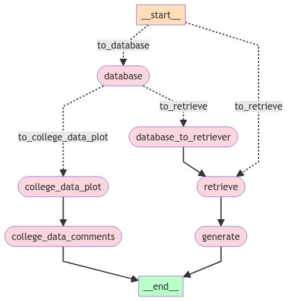

# Customized LLM Chatbot
Inspired by ChatGPT and other Large Language Models (LLMs), my initial impression was highly positive. However, after extensive use, it became clear that current LLMs have some limitations: they can be unstable, sometimes provide output in an undesired format, occasionally fabricate information, and often fail to deliver accurate answers. To make a chatbot suitable for real-world applications, such as serving customers at a company, we need a more reliable solution.

The solution is Knowledge-Based Retrieval Augmented Generation (RAG). RAG enhances LLMs by supplying them with relevant information based on stored knowledge, such as a vector store.

Additionally, we aim to create a chatbot that not only converses effectively but also can visualize college-related data, as it is designed for Forward Pathway LLC, an educational consulting company. To achieve this, we decompose our questions into several parts, feeding the LLM specific queries for each part. This approach increases the confidence and accuracy of the final response. This can be accomplished using LangChain, but we will employ LangGraph, an extension of LangChain, to design more complex chains of steps.

For rapid development, we will use Streamlit for the app interface and Matplotlib for data visualization. For data, we will utilize Forward Pathway's existing college database.

## Integrating LangGraph, Custom Knowledge Base Vectorstore, RAG, ChatGPT API, and College Data Visualization
Below is the LangGraph flow chart:

## LangGraph Flow Chart Explanation
Starting from the start, we input our question, which is then categorized into one of two categories: college data-related questions and general questions. This is identified by the conditional_entry_point and labeled by "to_database" and "to_retrieve" nodes.

- College Data-Related Questions:
  - If the question is data-related, it proceeds to the "database" node, which performs two tasks: extracting the college name from the question and using this college name along with the college list from our database to get college IDs (unitid for IPEDS) for further use. Additionally, it identifies whether the data type is plottable or not.
      - Plottable Data:
          The question then moves to the "college_data_plot" node, which retrieves and plots the data. Plotting in Python is straightforward, so this step is not elaborated here. Next, it proceeds to the "college_data_comments" node, where the LLM provides comments on the plotted data and adds any additional information if needed. Finally, the process reaches the end.
      - Non-Plottable Data:
        If the data is not plottable, the question is sent to the "database_to_retriever" node, where it is rewritten and forwarded to the "retrieve" node for further processing. This will be combined with RAG in the next section.
- General Questions:
  - For non-data-related questions, or questions that are not suitable for plotting, the process retrieves our knowledge base from a vector store by querying the question. Both the question and the retrieved documents are then sent to the final "generate" node, where the LLM formulates an answer, this Retrieval-Augmented Generation (RAG) procedure, supported by relevant documents, ensures that the answer is more accurate and reliable. Finally, the process reaches the end.

This architecture achieves remarkable results because each node in the flow chart asks very specific questions, allowing the LLM to provide accurate answers at each step. Consequently, we can expect a much better final answer compared to using pure LLMs alone.

## App file structure

- main.py # Streamlit main py file, can be executed by `streamlit run main.py`
- requirements.txt # has all required packages
- logos #folder for image files for logo and barcode
  - fp_logo.png
  - WeCom_barcode.png
- old_model_structure
    - Streamlit_LangChain.py
- utilities #folder for utitlities, like fonts, language dictionary and vector database generator/loader
  - colleges.py
  - knowledgebase.py
  - languages.py
  - MicrosoftYaHei.ttf
- vector #folder for stored vector stores, only basic knowledge base and college list here
  - colleges-data-vector.faiss
  - colleges-data-vector.pkl
  - knowledge-base-vector-emergency.faiss
  - knowledge-base-vector-emergency.pkl
  - knowledge-base-vector-lxbd.faiss
  - knowledge-base-vector-lxbd.pkl
  - knowledge-base-vector-lxbd_chunked.faiss
  - knowledge-base-vector-lxbd_chunked.pkl
  - knowledge-base-vector-lxsq.faiss
  - knowledge-base-vector-lxsq.pkl

>[!TIP]
>To enhance the user experience, especially for impatient customers, we integrate llm.stream() with st.write_stream(), enabling output streaming. This allows users to receive responses in real-time, improving the overall responsiveness and satisfaction.
